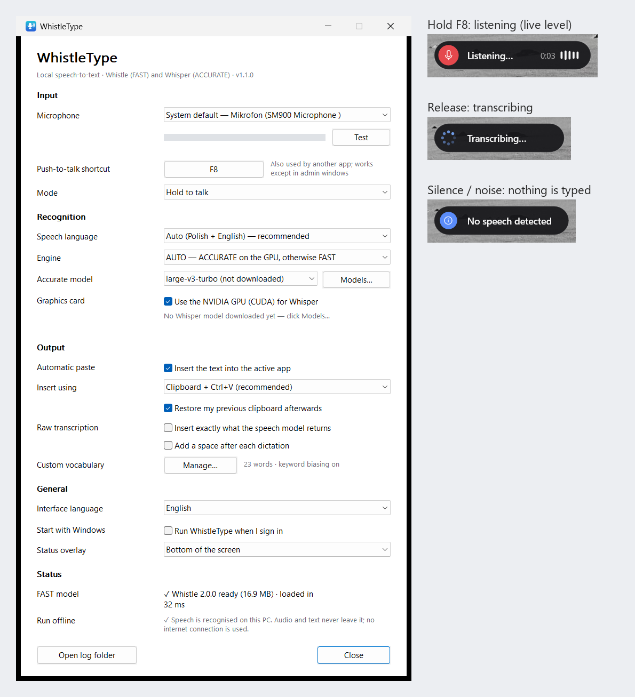
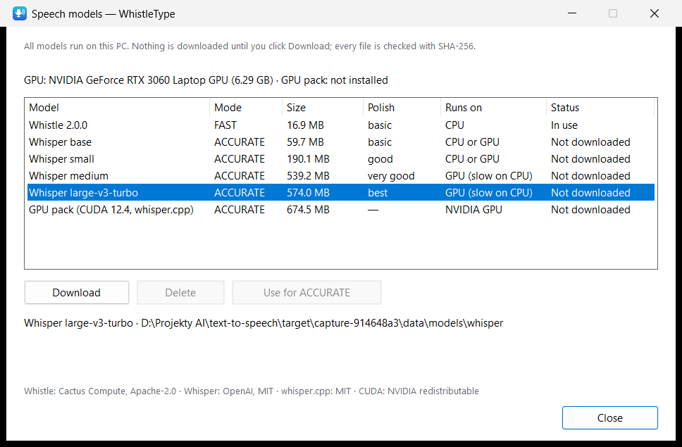
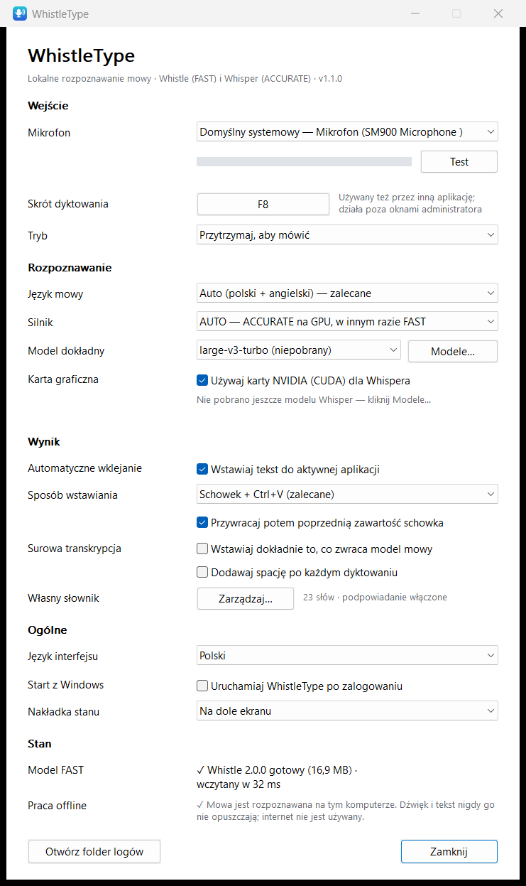

<p align="center"></p>

<h1 align="center">WhistleType</h1>

<p align="center">
<a href="https://github.com/apkmasondev/whistle-type/releases/latest"></a>

<a href="LICENSE"></a>

</p>

<p align="center"><b>Hold a key, speak, release — the text appears wherever your cursor is.</b><br>
Local push-to-talk dictation for Windows: <a href="https://cactuscompute.com/blog/whistle">Cactus Compute Whistle</a> for speed,
<a href="https://github.com/ggml-org/whisper.cpp">Whisper (whisper.cpp)</a> on your NVIDIA GPU for accuracy.</p>

> **Speech recognition is performed locally on the user's computer.**
> No audio and no text is sent anywhere; after the model downloads WhistleType works fully offline.



## What it does

WhistleType lives in the notification area. In any application — Claude Code, Codex, ChatGPT, a terminal,
VS Code, a browser, Notepad, a chat app — put the cursor in a text field and:

1. **hold F8** (configurable) → a small overlay shows *Listening…* with a live level meter,
2. speak — Polish, English, or Polish sentences with English technical terms (the main use case),
3. **release F8** → *Transcribing…* → the text is inserted at the cursor, and your clipboard is put back as it was.

Optional *press once to start, press again to stop* mode. **Esc** cancels a dictation.

## Two engines: FAST and ACCURATE

| Mode | Engine | Runs on | Best for |
|---|---|---|---|
| **FAST** | Whistle 2.0.0 (16.9 MB) | CPU | instant results on any PC, low memory |
| **ACCURATE** | Whisper (base / small / medium / large‑v3‑turbo) via whisper.cpp | NVIDIA GPU (CUDA) if available, otherwise CPU | best Polish quality, long sentences, technical vocabulary |
| **AUTO** (default) | ACCURATE when Whisper is ready on the GPU, otherwise FAST | | |

Choose the mode in *Settings → Recognition* or from the tray menu. **Speech models…** (Model Manager) shows each
model's size, Polish quality and where it runs, and downloads or deletes models and the optional **GPU pack**
(official whisper.cpp CUDA 12.4 build, 675 MB download). Nothing is downloaded until you click *Download*.
If the GPU is unavailable, Whisper runs on the CPU; if Whisper is not ready, the dictation uses FAST and tells you.
Measured comparison: [PERFORMANCE.md](PERFORMANCE.md#fast-vs-accurate-benchmark).

On this PC (RTX 3060 Laptop) Whisper large‑v3‑turbo makes **~6× fewer word errors on real Polish speech** than Whistle
(WER 5.7 % vs 35.5 % on FLEURS) and needs ~0.4–0.6 s per sentence; Whistle answers short phrases in ~0.1 s on the CPU.
On a CPU alone, Whisper models that beat Whistle take several seconds per sentence — that is why AUTO only switches
to Whisper when it runs on the GPU.

<p></p>

## How it works

| Step | Implementation |
|---|---|
| Global hotkey | `WH_KEYBOARD_LL` hook on its own thread; the hotkey is swallowed, so the focused app never sees F8. A `RegisterHotKey` fallback keeps it working while an administrator window is focused. |
| Audio | WASAPI shared mode, opened only while you hold the key. Windows converts the microphone to 16 kHz mono. Audio stays in memory — nothing is written to disk. |
| Speech gate | Recordings that are too short (< 250 ms), silent, steady noise, a click, typing or breathing are rejected before transcription (pitch-periodicity check — Whistle itself would otherwise turn keyboard noise into "Dziękuję bardzo."). |
| Recognition (FAST) | [Whistle 2.0.0](https://huggingface.co/Cactus-Compute/whistle) (16.9 MB) on the official Cactus Compute Needle 3 engine (`libneedle3.dll`), CPU only, called directly through its C API. Your custom vocabulary is passed as Whistle's native keyword biasing. |
| Recognition (ACCURATE) | Whisper models (GGML, q5) on the official [whisper.cpp](https://github.com/ggml-org/whisper.cpp) binaries, called through its C API. CPU DLLs ship with the app; the CUDA build is an optional download. Beam search on the GPU, greedy on the CPU. Your vocabulary becomes Whisper's initial prompt. |
| Language | Default **Auto (Polish + English)**: Whistle detects the language, so English commands and terms come out in English; if it detects anything else (e.g. fast Polish heard as Spanish), the clip is transcribed again as Polish. You can also force one of Whistle's 7 languages or allow any. |
| Long dictation | Whistle accepts 30 s per call; longer recordings (up to 5 min) are split at the quietest moments and transcribed in order. Whisper takes the whole recording. |
| Insertion | Clipboard + Ctrl+V with **full clipboard backup and restore**. The text is offered with delayed rendering, so WhistleType knows exactly when the target app read it, and reads by clipboard monitors before the paste are declined (the dictation does not end up in clipboard history). Alternatives: Shift+Insert, Ctrl+Shift+V, or typing characters without the clipboard. |
| Text | Only safe cleanup: trim and collapse whitespace; control characters (newline, Esc) are never inserted, so a dictation cannot execute a terminal command. *Raw transcription* inserts Whistle's output as-is (apart from control characters). |

Project page: **[https://apkmasondev.github.io/whistle-type-site/](https://apkmasondev.github.io/whistle-type-site/)**

Architecture, the research behind it and every source are in [RESEARCH.md](RESEARCH.md).
Measurements are in [PERFORMANCE.md](PERFORMANCE.md), the review in [AUDIT.md](AUDIT.md).

## Interface language

The interface is available in **Polish** and **English** (Settings → General → Interface language). The default
follows the Windows display language; switching rebuilds the open windows immediately.

<p></p>

## Privacy

- Speech is recognised on your PC by Whistle or Whisper. WhistleType contains no speech API client of any kind.
- The engine DLLs have no networking code (Needle: verified from its import table; whisper.cpp: see RESEARCH.md).
- The only network requests WhistleType can make are model / GPU‑pack downloads, and only after you click
  **Download** and confirm. Each fetches a pinned revision (Hugging Face / the whisper.cpp GitHub release) and verifies
  size + SHA-256. The FAST model can also be imported manually.
- Verified by test: during dictation the app opens no TCP/UDP sockets (see PERFORMANCE.md / AUDIT.md).
- Recordings are never written to disk. Transcripts are not logged (only lengths and timings), unless you enable
  `log_transcripts` in `settings.json` yourself.
- The Python `cactus-needle` package has opt-out telemetry; WhistleType does not use that package.

## Install

**Installer:** download `WhistleType-<version>-setup-x64.exe` from [Releases](https://github.com/apkmasondev/whistle-type/releases/latest) and run it. It installs for the current user
(no administrator rights) into `%LOCALAPPDATA%\Programs\WhistleType`, optionally starts with Windows, and can be
removed from *Settings → Apps*. On first start WhistleType explains and offers the one-time model download (16.9 MB).

**Portable:** unzip `WhistleType-<version>-portable-x64.zip` anywhere. Create an empty file `WhistleType.portable`
next to the exe to keep settings, logs and the model in `.\data`.

The builds are not code-signed yet, so SmartScreen may warn on first launch.

### Requirements

- Windows 10 (1809+) or Windows 11, x64. FAST needs only the CPU — no GPU, no runtime to install.
- ACCURATE on the GPU: an NVIDIA GPU with ≥ 2 GB VRAM and a driver ≥ 525 (no CUDA toolkit needed — the GPU pack
  contains the CUDA runtime). Without one, Whisper runs on the CPU (base/small recommended).
- FAST: 40–85 MB RAM while running, 0 % CPU when idle (measured, see PERFORMANCE.md). ACCURATE adds the Whisper model
  (≈ 0.5 GB working set and ≈ 1 GB VRAM with large‑v3‑turbo on the GPU). In FAST mode Whisper is not loaded at all.
- A microphone. Windows *Settings → Privacy & security → Microphone → Let desktop apps access your microphone* must be on.

### Data locations

| What | Where |
|---|---|
| Settings (incl. vocabulary) | `%APPDATA%\WhistleType\settings.json` |
| FAST model | `%LOCALAPPDATA%\WhistleType\models\whistle-2.0.0\whistle.cact` |
| ACCURATE models | `%LOCALAPPDATA%\WhistleType\models\whisper\ggml-*.bin` |
| GPU pack | `%LOCALAPPDATA%\WhistleType\runtimes\whisper-cuda-12.4-b5130\` |
| Logs (rotating, 1 MB) | `%LOCALAPPDATA%\WhistleType\logs\` |

The uninstaller asks whether to delete them.

## Limitations (honest list)

- ACCURATE on a CPU without an NVIDIA GPU is slow (small ≈ 7 s per sentence on an 8‑core Ryzen); it is meant for
  occasional, quality‑critical dictation. AMD/Intel GPUs are not used (the official Windows GPU build is CUDA only).
- Switching between the CPU and the GPU runtime (after installing or removing the GPU pack) needs a restart of the app.
- Whistle supports en, de, fr, es, it, nl and **pl**. Accuracy for English terms inside Polish speech depends on
  pronunciation; keyword biasing helps but is a hint, not a guarantee. In Auto (Polish + English) a Polish sentence
  that Whistle hears as English is kept as English text (only other languages trigger the Polish re-run).
- Windows does not allow a normal program to send keystrokes to an **administrator** window. There the text is put
  on the clipboard and the overlay asks you to press Ctrl+V.
- Whispered speech is rejected by the speech gate (it has no voiced pitch).
- Some terminals paste with Shift+Insert or Ctrl+Shift+V — choose that in *Insert using*.

## Build from source

Requirements: Rust (stable, `x86_64-pc-windows-msvc` + Visual Studio Build Tools), Python 3 (notices/tests),
[Inno Setup 6](https://jrsoftware.org/isinfo.php) for the installer.

```powershell
scripts\fetch-engine.ps1            # official libneedle3.dll + whisper.cpp CPU DLLs (+ VC++ runtime from VS), pinned + SHA-256 verified
cargo test --lib                    # unit tests
cargo run --release --bin WhistleType
scripts\build-release.ps1           # exe + portable zip + installer in dist\
```

Testing tools:

```powershell
scripts\fetch-engine.ps1 -WithModel        # also fetch whistle.cact for tests
scripts\gen-test-audio.ps1                 # Polish test set from the built-in Windows voices (offline)
python scripts\eval.py --release           # accuracy / speech gate on the test set (uses wt-bench)
cargo build --release --features test-hooks --target-dir target\e2e
powershell -File scripts\e2e\run-e2e.ps1   # end-to-end in Notepad, terminal, Edge, VS Code, WinForms
powershell -File scripts\perf.ps1          # performance numbers
powershell -File scripts\e2e\settings-ui.ps1   # settings, Model Manager, interface language
powershell -File scripts\e2e\accurate.ps1 -CudaZip <whisper-cublas-12.4.0-bin-x64.zip>   # ACCURATE on CPU and GPU, GPU pack install/removal
python scripts\fetch-whisper-models.py     # Whisper models for the benchmark (pinned, SHA-256)
python scripts\fetch-fleurs.py             # 60 FLEURS pl_pl utterances (CC-BY-4.0) for the benchmark
python scripts\bench-models.py --cuda-runtime <dir>   # FAST vs ACCURATE benchmark -> tests\results\bench-models.json
```

The `test-hooks` feature (WAV file instead of the microphone) only exists in test builds.

## Credits and licences

- **Whistle** speech model and the **Needle 3** engine by [Cactus Compute](https://cactuscompute.com),
  Apache License 2.0 — [cactus-compute/needle](https://github.com/cactus-compute/needle),
  [Cactus-Compute/whistle](https://huggingface.co/Cactus-Compute/whistle). WhistleType is an independent project and
  is not affiliated with Cactus Compute.
- **whisper.cpp / ggml** by the ggml authors, MIT — [ggml-org/whisper.cpp](https://github.com/ggml-org/whisper.cpp);
  **Whisper** model weights by OpenAI, MIT. The optional GPU pack is the official whisper.cpp CUDA build and contains
  NVIDIA CUDA runtime libraries (redistributable under the CUDA EULA). Not affiliated with OpenAI or NVIDIA.
- Rust crates (`windows`, `serde`, `serde_json`, `sha2`, `zip`, …) under MIT / Apache-2.0 / Zlib.
- Full list with versions: [THIRD_PARTY_NOTICES.md](THIRD_PARTY_NOTICES.md), licence texts in [LICENSES/](LICENSES/).

### Licence of WhistleType's own code

[MIT](LICENSE) © 2026 apkmasondev. Third-party components keep their own licences listed above.
